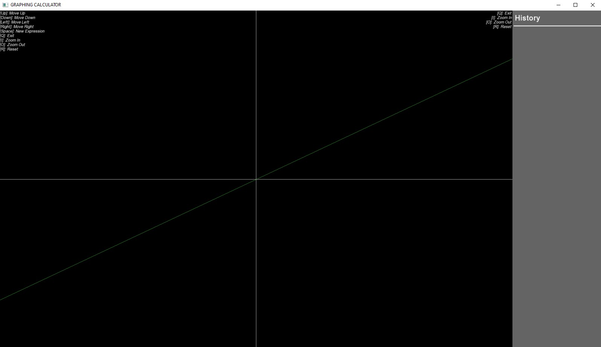
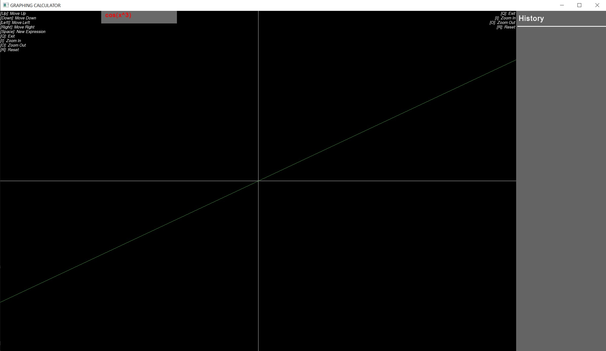
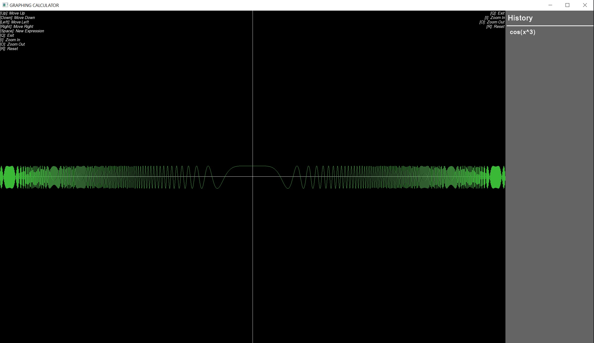

# Graphing Calculator

A graphing calculator application that allows users to input mathematical expressions and visualize their corresponding graphs. This tool supports a variety of expressions, including basic arithmetic operations and trigonometric functions like `sin`, `cos`, `tan`, `csc`, `cot`, and `sec`.

## Description

The Graphing Calculator provides an intuitive interface to analyze mathematical functions visually. Users can input expressions, view their graphical representations, and interact with the graph by moving or zooming in/out. The sidebar also displays a history of expressions entered.

### Features:
- **Expression Input**: Type and evaluate expressions with trigonometric functions and arithmetic operators.
- **Graph Navigation**: Move the graph left, right, up, and down, or zoom in and out for detailed analysis.
- **Expression History**: View a list of previous expressions in the sidebar for reference.
- **Supported Functions**: Graph basic expressions like `x^2 + y = 0` or trigonometric expressions like `cos(x^3) + 10sin(y)`.

## Dependencies

The Graphing Calculator uses the [SFML](https://www.sfml-dev.org/) (Simple and Fast Multimedia Library) for graphics rendering.

1. **Download**: Download the SFML package from [SFML Downloads](https://www.sfml-dev.org/download.php).

2. **Link Libraries**: Link the following SFML libraries to your project:
   - `sfml-graphics`
   - `sfml-window`
   - `sfml-system`

3. **Tutorials**: Follow the [official SFML tutorials](https://www.sfml-dev.org/tutorials/2.6/) to set up SFML for your preferred development environment.

## Usage

1. **Run**:
   - Navigate to the `bin` folder containing the compiled executable and required SFML files.
   - Launch the Graphing Calculator executable.

2. **Keyboard Commands**:
   - `[Up]`: Move the graph up.
   - `[Down]`: Move the graph down.
   - `[Left]`: Move the graph left.
   - `[Right]`: Move the graph right.
   - `[Space]`: Start typing a new expression.
   - `[Enter]`: Submit the expression for evaluation.
   - `[Q]`: Exit the application.
   - `[I]`: Zoom in.
   - `[O]`: Zoom out.
   - `[R]`: Reset the graph to the default view.

3. **Screenshots**:
   - **Initial Screen**: The initial interface when the application is first opened.
   
     
   
   - **Entering an Expression**: How the application looks when typing an expression to graph.
   
     
   
   - **Graphed Expression**: How the graph is displayed after entering and evaluating the expression.
   
     

## Development Notes

- **Focus on Data Structures**: This project emphasizes creating and demonstrating custom-built data structures like lists, stacks, and queues.
- **Shunting Yard Algorithm**: Utilizes the shunting yard algorithm and tokenization for accurate expression parsing and evaluation.
- **Modular Structure**: Uses a modular structure with separate files for different functionalities like input parsing, graph drawing, and shunting-yard evaluation.
- **Maintainability**: Refactored to include reusable data structures and utility functions for improved maintainability.
